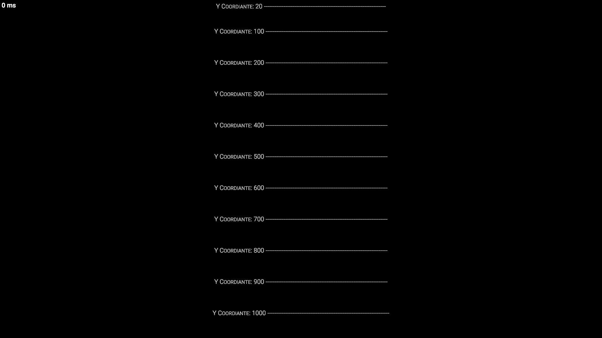
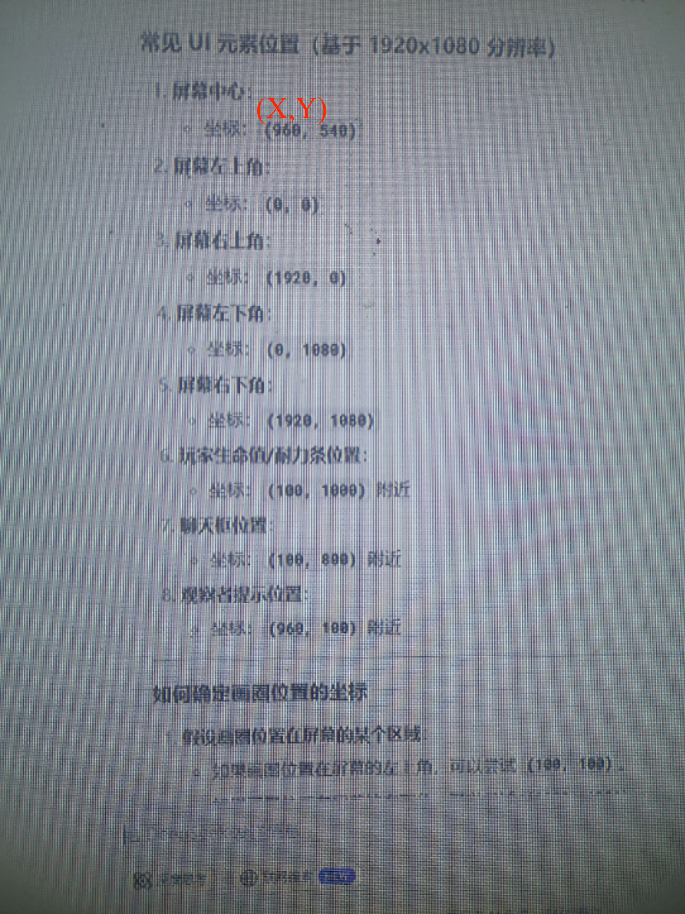

# CustHintShow
CustHintShow(CHS)一个scp sl的消息显示api|╭(╯^╰)╮
# 使用
示例代码\n
```Csharp
var hint1 = new CustHintShow.Hints.Hint
{
    X = 960,
    Y = 600,
    Size = 20,
    Text = "欢迎游玩服务器"
};
var showplayer = CustHintShow.Display.Get(player);//使用CustHintShow.Display.Get(player)获取玩家
showplayer.Add(hint1);//显示提示
showplayer.Delete(hint1);//删除提示
```
#### 属性
| 属性 | 描述 |
| - | - |
| Size | 文本的大小 |
| Text | 文本 |
| X | 文本的水平位置。X 坐标越大，文本显示越靠右 |
| Y | 文本的垂直位置。Y 坐标越大，文本显示越靠下 |
 |
## X,Y坐标

\n

## 联系
---
QQ:3145186196
---
## 更多的
```Csharp
private void OnVerified(VerifiedEventArgs ev)
{
    ev.Player.AddHint(float x, float y, int size, string text, float duration)
    //x为X坐标，y为y坐标， size为文本的大小, text为文本, duration为显示时间，用秒作单位
}
```
